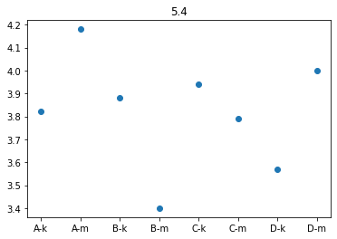

## 1

FFPF \
PFFP \
FPFF \
FFFP \
PPPP

## 2.1
| p   | q   | pq   |
|-----|-----|------|
| 61  | 67  | 6671 |
| 83  | 19  | 8139 |
| 7   | 71  | 771  |

## 2.2
```py
single_digit = [2, 3, 5, 7]
double_digit = [11, 13, 17, 19, 23, 29, 31, 37, 41, 43, 47, 53, 59, 61, 67, 71, 73, 79, 83, 89, 97]
for p in single_digit:
	for q in double_digit:
		n = 100 * (q // 10) + 10 * p + (q % 10)
		print(n)
```

## 2.3
```py
def is_prime(n):
	num = 2

	if n == 1:
		return False

	if n == 2 or n == 3:
		return True

	while num ** 2 <= n:
		if n % d == 0:
			return False
		else:
			num += 1

	return True


def factor(n):
	k = 1
	p = 0
	q = 0
	while n > 0:
		r = n % 10
		p += r * k
		n = n // 10
		r = n % 10
		q += r * k
		n = n // 10
		k += 10

	return p, q


if __name__ == "__main__":
	n = int(input())
	p, q = factor(n)

	print("TAK" if is_prime(p) and is_prime(q) else "NIE")
```

## 3.1

\[1, 2, 3, 6, 7, 9, 0\]
\[1, 2, 3, 4, 9, 7, 5\]

## 3.2

flip(1, 3), flip(2, 4), flip(3, 5), flip(4, 5)

## 3.3

n - 1

## 3.4

```
for i in range(1, n):
	min_ix = min(range(i, n + 1), key=tab.__getitem__)
	if min_ix != i:
		flip(i, min_ix)
		print(f"flip({i}, {min_ix})")
```

## 4.1

Nr wierszy:
0, 15, 27, 42, 55, 90, 99
Nr kolumn:
0, 81, 92, 199

## 4.2

Długość:
10
Nr wierszy:
62, 72

## 4.3

Wysokość:
13
Szerokość:
2
Nr wiersza:
71
Nr kolumny:
102

## 5.1
439

## 5.2

| uczeń | średnia |
| ----- | ------- |
| B26   | 1.65    |
| C8    | 2       |
| C15   | 2.06    |
| A27   | 2.61    |
| D28   | 2.78    |
| B10   | 2.83    |
| A12   | 2.88    |
| B13   | 2.91    |
| D27   | 3       |
| D29   | 3       |

## 5.3

| uczeń | ocena |
| ----- | ----- |
| D20   | 3     |
| D21   | 5     |
| D22   | 4     |
| D23   | 3     |
| D24   | 5     |
| D25   | 4     |
| D26   | 4     |
| D27   | 3     |
| D28   | 3     |
| D29   | 3     |

## 5.4
- A \
  kobiety: 3.82
  mężczyźni: 4.18
- B \
  kobiety: 3.88
  mężczyźni: 3.4
- C \
  kobiety: 3.94
  mężczyźni: 3.79
- D \
  kobiety: 3.57
  mężczyźni: 4



## 5.5

| Imię    | Nazwisko     | Ocena |
| ------- | ------------ | ----- |
| Beata   | Kwiatek      | 5     |
| Sylwia  | Mazur        | 6     |
| Maria   | Nowicka      | 5     |
| Maria   | Prus         | 5     |
| Tamara  | Siwek        | 5     |
| Lesław  | Wolski       | 6     |
| Dagmara | Ziarno       | 6     |
| Elwira  | Zimkiewicz   | 6     |
| Mariusz | Ciechanowicz | 5     |
| Wanda   | Jabłońska    | 5     |
| Wiesław | Kajakowicz   | 6     |

## 5.6

niższa ocena: 100
wyższa ocena: 4

## 6.1

155

| id   | imię        | nazwisko |
| ---- | ----------- | -------- |
| 1002 | Maksymilian | Htbacki  |
| 1912 | Letycja     | Okbacka  |

## 6.2

71, 71

### kobiety
| id   | imię     | nazwisko |
| ---- | -------- | -------- |
| 1004 | Marianna | Fobacka  |
| 1910 | Wirydina | Libacka  |

### mężczyźni
| id   | imię    | nazwisko |
| ---- | ------- | -------- |
| 1019 | January | Rfbacki  |
| 1906 | Wenanty | Mcbacki  |

## 6.3

141; 18

## 6.4

### kobiety
| liczba | nazwa              |
| ------ | ------------------ |
| 52     | BioNTex Pfizer     |
| 88     | Moderna            |
| 67     | Oxford AstraZeneca |
| 18     | Johnson & Johnson  |

### mężczyźni
| liczba | nazwa              |
| ------ | ------------------ |
| 50     | BioNTex Pfizer     |
| 86     | Moderna            |
| 70     | Oxford AstraZeneca |
| 17     | Johnson & Johnson  |
